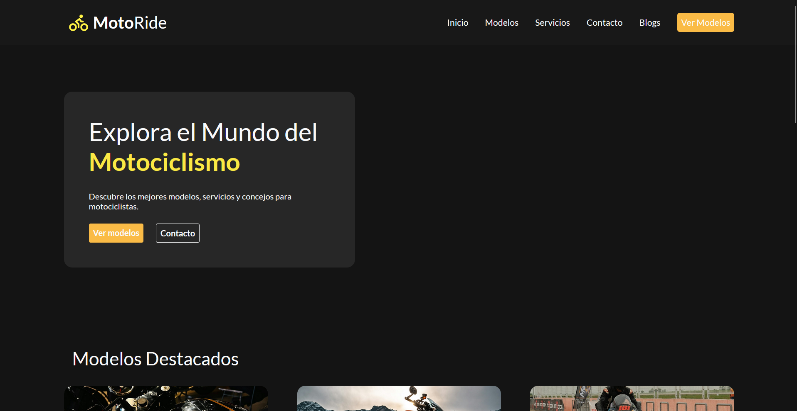

# 🏍️ MotoRide Landing Page

[](https://fernandahiguita.github.io/motoride-responsive-website/)

A modern and responsive motorcycle showcase website built with **HTML5** and **CSS3**. This project highlights motorcycle models, services, articles, and contact information while demonstrating responsive web design principles and clean frontend development practices.

## 📸 Preview



---

## 🚀 Features

* Responsive design for different screen sizes
* Modern and clean user interface
* Semantic HTML5 structure
* CSS Grid and Flexbox layouts
* Featured motorcycle models section
* Services and articles sections
* Contact form
* Organized project structure

---

## 🛠️ Technologies Used

* HTML5
* CSS3
* CSS Grid
* Flexbox
* Google Fonts

---

## 📂 Project Structure

```text
motoride-landing-page/
│
├── index.html
├── README.md
│
├── css/
│   └── style.css
│
└── assets/
    ├── img/
    └── svg/
```

## 📚 What I Practiced

Through this project I strengthened my knowledge in:

* Semantic HTML structure
* Responsive web design
* Layout design with CSS Grid
* Component alignment using Flexbox
* Visual hierarchy and spacing
* Frontend project organization

---

## 🎯 Learning Objective

The goal of this project was to practice modern frontend development concepts while creating a responsive landing page without using external frameworks or libraries.

---

## 👩‍💻 Author

**Fernanda Higuita**

Software Development Student

Interested in Data Analytics, Data Engineering, and Web Development.


